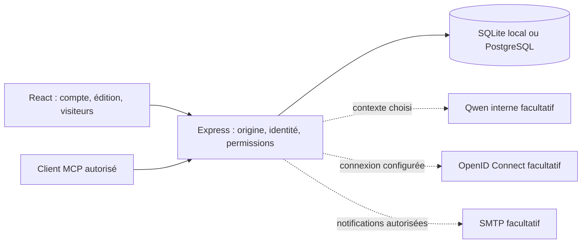

# Architecture de MeetLoom

Une application Node.js 24 sert l'API Express et l'interface React compilée par Vite. SQLite permet un lancement local sans service supplémentaire ; PostgreSQL est la cible des déploiements durables. La configuration distribuée utilise un pod applicatif. Aucune donnée de séance ne requiert un service cloud externe.

## Modules

| Domaine                 | Emplacement                                                   | Responsabilité                                                                                             |
| ----------------------- | ------------------------------------------------------------- | ---------------------------------------------------------------------------------------------------------- |
| Modèle et métier        | `shared/`                                                     | Arbres de blocs, horaires, minuteur, validation, fusion, projection publique, documents riches et contenus |
| Assemblage API          | `server/app.ts`                                               | Identité, autorisation effective, sessions, écriture transactionnelle avec contrôle de version             |
| Stockage                | `server/db.ts`                                                | SQL paramétré commun, transactions PostgreSQL, sérialisation SQLite                                        |
| Comptes et services     | `accounts.ts`, `oidc.ts`, `mailer.ts`                         | Profils, récupération, révocation, connexion organisationnelle et messages facultatifs                     |
| Organisation            | `workspaces.ts`, `folders.ts`, `activity.ts`                  | Membres et invités, réglages, dossiers persistants, marqueurs de lecture                                   |
| Collaboration           | `participants.ts`, `comments.ts`, `presence.ts`, `sharing.ts` | Invitations, mentions, discussions internes/publiques et liens bornés                                      |
| Mémoire et cycle de vie | `history.ts`, `lifecycle.ts`                                  | Versions, journal, éléments supprimés, clôture et corbeille de séances                                     |
| Contenus et transferts  | `content-api.ts`, `transfers.ts`                              | Pages, formulaires/réponses et déplacements atomiques entre agendas                                        |
| IA et imports           | `ai*.ts`, `document-*.ts`                                     | Contexte explicite, réponses structurées validées, extraction temporaire bornée                            |
| Interface               | `src/`                                                        | Tableau de bord, éditeur, vues publiques et panneaux chargés selon le parcours                             |
| Déploiement             | `Dockerfile`, `k8s/`, `scripts/`                              | Image rootless, ressources génériques et installation par l'opérateur                                      |

## Documents, permissions et transactions

L'agenda est un document JSON versionné. Ses objets ont des identifiants stables ; la validation borne les tailles, la profondeur et les références. La sauvegarde incrémente la version seulement si la version précédente correspond. Historique, mentions et registre des dossiers participent à la même transaction. Une copie ou un déplacement entre agendas régénère les identifiants nécessaires et conserve la confidentialité des champs importés.

Les appartenances à un espace et le cycle de vie sont stockés séparément. `workspaceId` et `lifecycle` sont ajoutés aux réponses depuis ces tables, retirés du JSON persistant et exclus des champs modifiables par le navigateur. Les droits effectifs combinent propriété, collaboration explicite et rôle d'espace. Le propriétaire conserve ses droits ; un invité d'espace n'obtient pas les autres séances de cet espace.

Les écritures annexes verrouillent la ligne de séance avant de vérifier clôture/suppression. Cela évite qu'une réponse de formulaire ou un commentaire soit accepté après une clôture concurrente. Les jetons de session, d'invitation, de récupération, de partage et MCP ne doivent jamais être journalisés ; leur stockage suit les mécanismes dédiés de hachage et d'expiration.

## Limites de confiance

Une projection publique est construite explicitement côté serveur. Elle ne transmet ni colonnes d'équipe, ni commentaires internes, ni versions, ni données d'organisation. Les liens peuvent restreindre les contenus autorisés. Les exports pour participants utilisent également une projection avant sérialisation ; les exports d'équipe sont des actions explicites.

Le texte riche est un arbre JSON validé, rendu par une liste de composants React et d'attributs sûrs. L'import n'est pas un stockage de pièces jointes : contenu et temps de traitement sont bornés, les archives et XML non sûrs sont refusés. L'IA reçoit le contexte choisi via un endpoint serveur configuré ; sa sortie devient une proposition validée, jamais une mutation privilégiée libre.

OIDC et SMTP n'existent dans le parcours que s'ils sont configurés. Les tests emploient des adaptateurs locaux simulés ; l'interopérabilité avec les services propres à une installation est une étape de validation distincte.

## Conservation et exploitation

Les éléments supprimés sont récupérables 72 heures ; les séances placées dans la corbeille, 30 jours. Les versions automatiques et nommées ont des limites séparées, et les nettoyages sont bornés. Voir [le guide des espaces et de la récupération](docs/workspaces-and-lifecycle.md) pour les règles exactes, et [l'exploitation](docs/operations.md) pour les sauvegardes.

La CI exécute les contrats API sur SQLite et PostgreSQL, compile les deux parties et vérifie les manifests. La release reconstruit le commit choisi, effectue un smoke test sous UID arbitraire/racine en lecture seule, scanne l'image puis publie sur Docker Hub. Le cluster est mis à jour séparément par l'opérateur ; GitHub ne dispose d'aucun identifiant de cluster.
